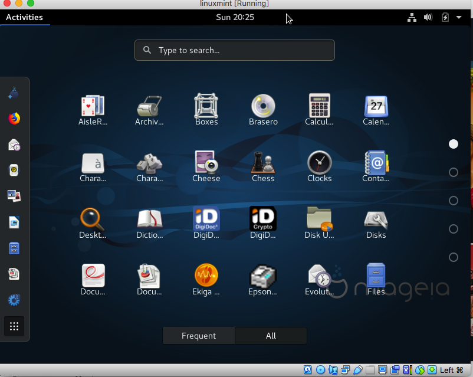
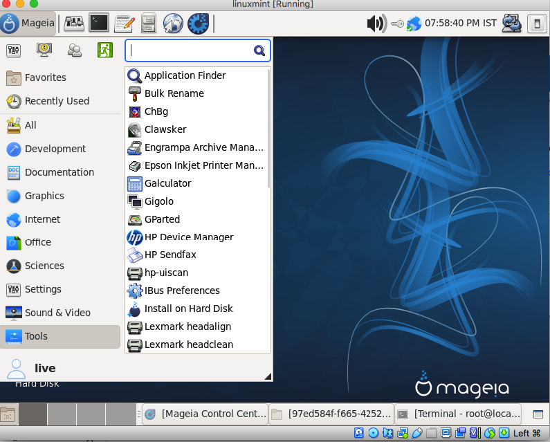

## Quick Review of Mageia Linux

### Introduction

I had always wanted to try "Mandriva Linux distribution" but never got the chance to try the original distribution hence when I got an old DVD of Mageia Linux, I wanted to try it out, it was a 6.1 GNOME version ISO. Later I also tried 7.1 Xfce ISO which I thought would look a more newer, light weight UI version.

### First Impressions & Issues

Again as I just wanted to try it out before deciding if I wanted to dig further. My first impression of both impression was that the UI was very dated or should I say very stock. There is nothing wrong having a stock UI but both 6.1 GNOME and the 7.1 Xfce version in an effort to make a consistent UI ended up making a bit old. 

After getting used to the stock UI the next then was checking out the list of softwares. One thing that I like in other Linux distributions and don't  like Mageia Linux GNOME 6.1 Version is instead of a Start Button it has something called "Activity" and that opens a search bar with set of standard softwares. And Icon based categorization of software is was not very intutive for me. But in Xfce 7.1 version this issue was resolved.

This is not a problem specific to "Mageia Linux" its something common to few other Linux distributions who choose this UI design (e.g. Ubuntu).
But the biggest problem I had with both the GNOME and Xfce version of Mageia was that while running it on my 4GB VM all UI interactions were very slow and either I had to click multiple times at an Icon or it took some time to start a program. As a first impression it did not come across as a light weight OS and rightly they did not advertise it as one.

### The Good Parts

After the first impressions I wanted to explore its software catalog and also wanted to explore some of its stand out features. For me the best part of Mageia Linux was its extensive software Library for all your needs and its extensive documentation. 

Be it from once you boot it for the first time or searching for its online documentation for which you will get a handy link. For each of its features the documentation was extensive.

Another feature that I liked about Mageia Linux was its "Magia Control Center" which was in addition to the Settings menu it has. The Control Center makes some of the setups e.g. for Hardware/Software/Network/Disk & Security setup easier which would make the maintenance of your system easier.

The most important feature for me was teh support of yum package manager from command line. Personally I like commandline to install packages and softwares and to have the familiar yum package manager from RedHat, Fedora and CentOS in  Magia made me feel at home.

## Final Thoughts

For me the deal maker was the blue color theme and the familiar stock Linux UI from many years back but the slow performance of the UI interactions and sometimes confusing UI navigation was the deal breaker. But if I have to choose a yum based Linux distribution which is not Fedora, Redhat or Cent OS, I may choose Mageia. Finally my high respect for the community behind Mageia for continuing the legacy of Mandriva Linux.